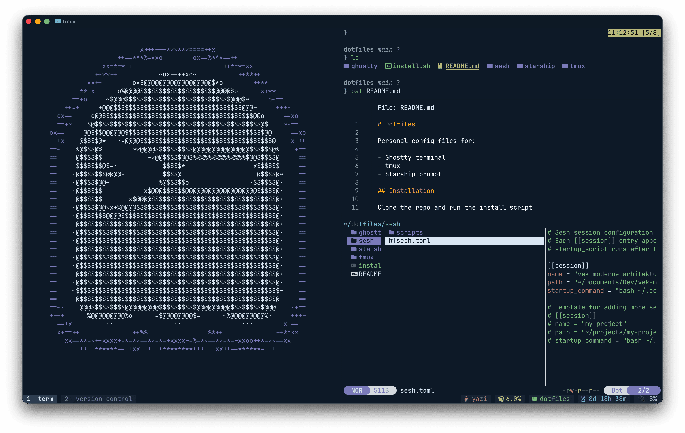
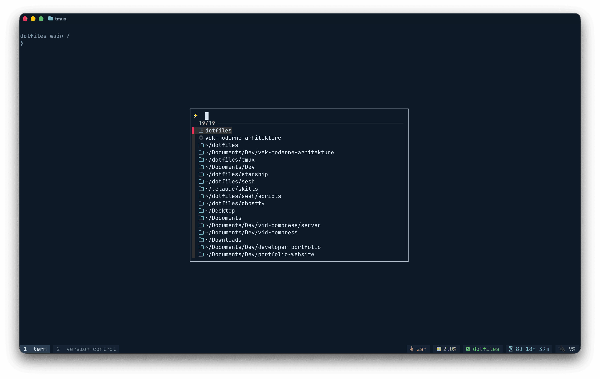

# Dotfiles

<table>
  <tr>
    <td></td>
    <td></td>
  </tr>
</table>

Personal config files for:

- Ghostty terminal
- tmux
- Starship prompt

## Installation

Clone the repo and run the install script
`./install.sh`
